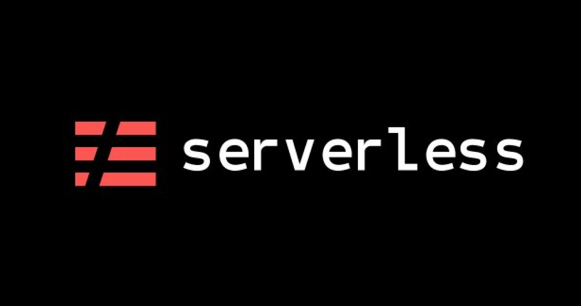

# Ignite Nodejs: Serverless Challenge

<h3 align="center">
  Iniciando a API
</h3>

## :computer: Sobre a API

O projeto tem como responsabilidade de gerar, atualizar, deletar e buscar notas do usuário utilizando serverless.

## ✨ Tecnologias

Esse projeto foi desenvolvido com as seguintes tecnologias:

- [Node.js](https://nodejs.org/en/)
- [Typescript](https://www.typescriptlang.org/)
- [Serverless Framework](serverless.com/)
- [Puppeteer](https://github.com/puppeteer/puppeteer)
- [Amazon Lambda](https://aws.amazon.com/pt/lambda/)

## 🚀 Como executar

- Clone o repositório e acesso o diretório

### Para rodar localmente

- Rode `yarn` para instalar as dependências
- Rode `yarn dynamodb:install` para baixar o DynamoDB localmente
- Rode `yarn dynamo:start` para iniciar o banco de dados em ambiente local
- Rode, em outro terminal, o `yarn dev` para iniciar a aplicação em ambiente local

### Para fazer o deploy

- Configurar as credenciais do usuário
- Rode `yarn deploy` para subir o projeto para AWS Lambda

## 📄 Licença

Esse projeto está sob a licença MIT. Veja o arquivo [LICENSE](LICENSE.md) para mais detalhes.